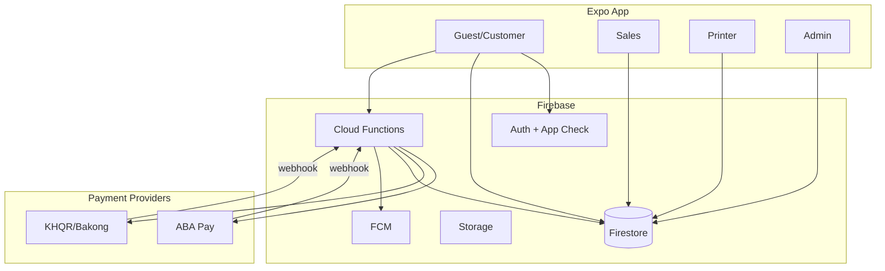

# SiteHub — Production Roadmap (MVP → 9/10)

**Current blended score: ~5.5/10** | **Target: 9/10 per category** | **Focus: NFC card sales → pay → produce → ship → profile**

This document is the single source of truth for implementation order, files, schema, rules, APIs, and success criteria. Do not add features outside this scope until Phase H is complete.

---

## Architecture target

**Golden rule:** `orders.paymentStatus` may only transition to `paid` via **Cloud Functions** (webhook or verified provider API). Clients never set `paid`.

---

## Dead code & flows to remove (Phase 0 — week 1)

| Item | Action | Files |
|------|--------|-------|
| `guest-choose-card` | Redirect → `guest-design` | `app/guest-choose-card.tsx`, remove nav refs |
| `guest-checkout` | Already redirect; delete screen after 1 release | `GuestCheckoutScreen.tsx` |
| `guest-post-login-choice` | Merge into single `checkout/[cardId]` + account sheet | Deprecate route |
| `confirmCambodiaPayment` stub success | Replace with `paymentService.initiate` | `cambodiaPaymentService.ts` |
| Sales manual `paymentStatus: paid` | Remove from rules + UI | `firestore.rules`, `OrderDetailScreen2.tsx` |
| `legacy/` folder | Exclude from build; delete when unused | `legacy/**` |
| Duplicate `OrderDetailScreen` | Keep `OrderDetailScreen2` only | `OrderDetailScreen.tsx` |
| Full-collection admin reads | Already partial; finish migration | `AdminReportsScreen`, `getProductionStats` |

---

## Database schema (Firestore)

### New collections

#### `payment_intents/{intentId}`
| Field | Type | Notes |
|-------|------|-------|
| orderId | string | Required |
| userId | string | payer uid |
| methodId | string | `aba` \| `khqr` \| `acleda` \| `wing` \| `cod` |
| amount | number | |
| currency | string | `USD` \| `KHR` |
| status | string | `pending` \| `processing` \| `paid` \| `failed` \| `expired` \| `refunded` |
| provider | string | `aba` \| `bakong` \| `sandbox` |
| providerRef | string | gateway txn id |
| qrPayload | string | KHQR EMV string or deeplink |
| abaDeeplink | string? | |
| failureReason | string? | |
| idempotencyKey | string | |
| createdAt | timestamp | |
| updatedAt | timestamp | |
| paidAt | timestamp? | |
| expiresAt | timestamp | |

#### `payment_events/{eventId}` (append-only audit)
Webhook payloads, idempotency for retries.

#### `refunds/{refundId}`
orderId, amount, reason, status, createdBy, providerRef.

#### `invoices/{invoiceId}`
orderId, invoiceNumber, lineItems[], pdfUrl?, issuedAt.

#### `app_config/ops` (extend)
`defaultSalesUid`, `scanTestEnabled`, `paymentProviders: { aba, khqr }`, `sandboxPaymentsEnabled`.

#### `stats/daily_{yyyyMMdd}` (aggregates — Phase G)
ordersCreated, revenueKhr, paidCount, deliveredCount.

### Order fields (extend)
- `paymentIntentId`, `invoiceId`, `refundedAt`, `refundStatus`
- Keep `commissionAccruedAt`

### Indexes (`firestore.indexes.json`)
- `payment_intents`: `orderId` + `createdAt` desc
- `payment_intents`: `userId` + `status` + `createdAt`
- `payment_events`: `providerRef` (unique lookup)
- `refunds`: `orderId` + `createdAt`

---

## Cloud Functions (required)

| Function | Type | Purpose |
|----------|------|---------|
| `createPaymentIntent` | Callable v2 | Create intent + call ABA/KHQR API |
| `paymentWebhookAba` | HTTP v2 | Verify signature → mark paid |
| `paymentWebhookKhqr` | HTTP v2 | Bakong/KHQR callback |
| `markOrderPaid` | Internal | Transaction: order + card publish + notifications |
| `initiateRefund` | Callable | Admin/sales → provider refund |
| `generateInvoice` | Callable | PDF to Storage, write `invoices` |
| `aggregateDailyStats` | Scheduled | Roll up `stats/daily_*` |
| `onOrderStatusChange` | Firestore trigger | Notifications + audit |
| `telegramLogin` | Existing | Keep |

**Secrets:** `ABA_API_KEY`, `ABA_WEBHOOK_SECRET`, `KHQR_MERCHANT_ID`, `KHQR_WEBHOOK_SECRET`, `PAYMENT_SANDBOX_SECRET`

---

## Firestore rules (production)

1. `payment_intents`: read if `userId == auth.uid` or admin; **write: false** (Functions only)
2. `orders`: remove `paymentStatus` from sales `onlyChanged`; add `paymentIntentId` customer read-only
3. `refunds`, `invoices`: read owner/admin; write Functions only
4. `payment_events`: admin read only
5. App Check enforced on all callable/HTTP functions

---

## APIs (client → Functions)

| Client method | Endpoint | Auth |
|---------------|----------|------|
| `initiatePayment(orderId, methodId)` | `createPaymentIntent` | Firebase Auth |
| `pollPaymentIntent(intentId)` | Firestore listener | — |
| `requestRefund(orderId, reason)` | `initiateRefund` | Sales/Admin |
| `fetchInvoice(orderId)` | get `invoices` doc | Customer owner |

---

## UI screens (required)

| Route | Phase | Purpose |
|-------|-------|---------|
| `/checkout/[cardId]` | A,B | Single checkout + KHQR display + poll |
| `/payment/[intentId]` | A | Payment status / retry |
| `/order-receipt/[orderId]` | A | Receipt (exists — enhance) |
| `/account/orders` | B | Customer history |
| `/admin/finance` | A,H | Revenue, refunds, failed payments |
| `/admin/production` | H | Ops snapshot |
| Remove `/guest-post-login-choice` | B | |

---

## Implementation order (12 weeks realistic)

### Week 1 — Phase 0 + A foundation ✅ (implemented in repo)
- [x] `payment_intents` / `payment_events` rules + indexes
- [x] `functions/payments.js` — `createPaymentIntent`, `paymentWebhookSandbox`, `paymentWebhookAba`
- [x] `src/services/paymentService.ts` — callable + Firestore listener
- [x] Block client `paid` — `firestoreService.updateOrderDetails`, `paymentStatusUnchanged()` rules
- [x] Sales UI — payment status read-only (`OrderDetailScreen2`)
- [x] `/checkout/[cardId]` — create order → intent → poll → paid
- [x] `/payment/[intentId]` - QR/deeplink payment status, retry, receipt handoff
- [x] `/order-receipt/[orderId]` - payment metadata + invoice PDF action
- [ ] Deploy Functions + set `PAYMENT_SANDBOX_SECRET`, `ABA_WEBHOOK_SECRET`
- [ ] Real ABA/KHQR merchant API (replace `qrPayload` stub)
- [x] `/admin/finance` — recent payment intents, invoice generation, sandbox refunds
- [x] `generateInvoice` / `initiateRefund` callables — Function-owned invoice/refund writes
- [ ] Real provider refund API + branded invoice PDF template

### Week 2 — Phase A production
Deployment status (2026-06-05):
- [x] Firestore rules + indexes deployed to `sitehub-8dd56`
- [ ] Cloud Functions deploy blocked: Firebase project must be upgraded to Blaze before Secret Manager / Functions secrets can be used
- [ ] Storage rules deploy blocked: Firebase Storage must be initialized in console first
- [ ] Local sandbox payment smoke added: `npm run test:payment:sandbox` (requires `firebase-service-account.json` or `GOOGLE_APPLICATION_CREDENTIALS`)

- ABA merchant API integration (real credentials)
- KHQR static QR + Bakong callback
- Receipt email (Resend/SendGrid via Function)

### Week 3 — Phase B
- Unify guest → `checkout/[cardId]` only
- [x] Unify guest checkout CTAs/deep links -> `checkout/[cardId]` or `guest-design`
- [x] `/account/orders` customer history route + unpaid order payment recovery
- Onboarding 3-step
- Account upgrade sheet everywhere

### Week 4 — Phase C
- [x] Batch complete/cancel UI with guarded close/cancel service checks
- [x] Reprint SLA dashboard for open, overdue, blocked, and done replacement jobs
- [x] Label preview with printable PDF template
- [x] Barcode Code128 on production order label

### Week 5 — Phase D
- App Check on app + Functions
- Rate limit HTTP webhooks
- Audit log via Functions only
- Field-level payment state machine in rules

### Week 6 — Phase E
- FCM server push on all stage transitions
- Notification preferences

### Week 7–8 — Phase F
- Design system pass (spacing, empty/loading/error)
- Screen-by-screen QA

### Week 9 — Phase G
- `stats/daily_*` aggregates
- Replace `getProductionStats` full scans
- Performance monitoring (Sentry + Firebase Performance)

### Week 10–12 — Phase H
- Role dashboards: finance, production, support
- Analytics export
- Investment data room metrics

---

## Success criteria (9/10 gates)

| Category | 9/10 means |
|----------|------------|
| Revenue | 100 consecutive orders paid via webhook with zero manual `paid` |
| User | <5% support tickets on “where is my order” |
| UX | SUS ≥ 75 on guest checkout task test |
| Security | Pen test: no cross-tenant order read |
| Ops | Median order→ship < 72h measured in app |
| Scale | 10k orders list <2s P95 with pagination |
| Launch | 30 days production with <1% payment dispute |
| Investment | $10k MRR traceable in finance dashboard |

---

## Risk analysis

| Risk | Mitigation |
|------|------------|
| ABA/KHQR API delay | Sandbox + manual webhook replay tool in admin |
| Rules lockout | Staged deploy + emulator tests |
| App Check breaks dev | Debug provider + CI bypass env |
| Commission double-pay | `commissionAccruedAt` + transaction |
| Webhook replay | `payment_events` idempotency on `providerRef` |

---

## Files modified first (Phase A)

See git diff for: `functions/payments.js`, `functions/index.js`, `src/services/paymentService.ts`, `firestore.rules`, `app/checkout/[cardId].tsx`, `src/constants/collections.ts`, `firestore.indexes.json`.
